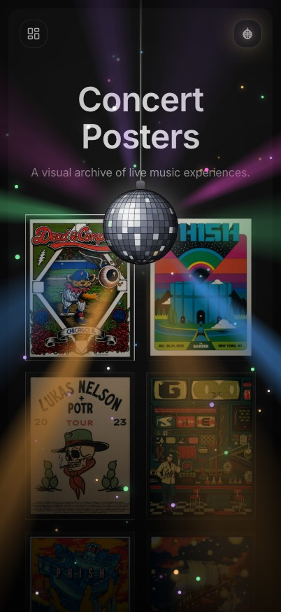

# Disco Ball Toggle

A canvas-rendered disco ball animation and theme toggle for React.



[Watch the MP4 demo](./demo/disco-ball-toggle-demo.mp4)

## Features

- 648 individually rendered mirror facets
- Procedural lighting, reflections, and colored glints
- Rotating light beams and deterministic sparkles
- Spring-powered drop animation and winch-style exit
- SVG toggle icon included
- Reduced-motion support
- No image assets required by the component

## Requirements

- React 18 or newer
- `framer-motion` 11 or newer
- `next-themes` 0.4 or newer
- Tailwind CSS

## Installation

Copy the `src` directory into your project or add this directory as a workspace package. Install the peer dependencies:

```bash
pnpm add framer-motion next-themes
```

Render the toggle anywhere inside a `next-themes` provider:

```tsx
import { DiscoBallToggle } from "disco-ball-toggle"

export function Header() {
  return <DiscoBallToggle />
}
```

The package entry point imports the required CSS. If you copy the component directly, import `disco-ball-toggle.css` once in your application.

## Interaction

The first click switches to dark mode and drops the mirror ball. Once it lands, the canvas spins while the beams and sparkles fade in. A second click fades the lights, hoists the ball, and switches back to light mode after it clears the viewport.

Reduced-motion users receive an immediate theme change and a static ball.

## Icon

The toggle icon is exported separately:

```tsx
import { DiscoBallIcon } from "disco-ball-toggle"

<DiscoBallIcon active={false} />
```

## License

[MIT](./LICENSE)
